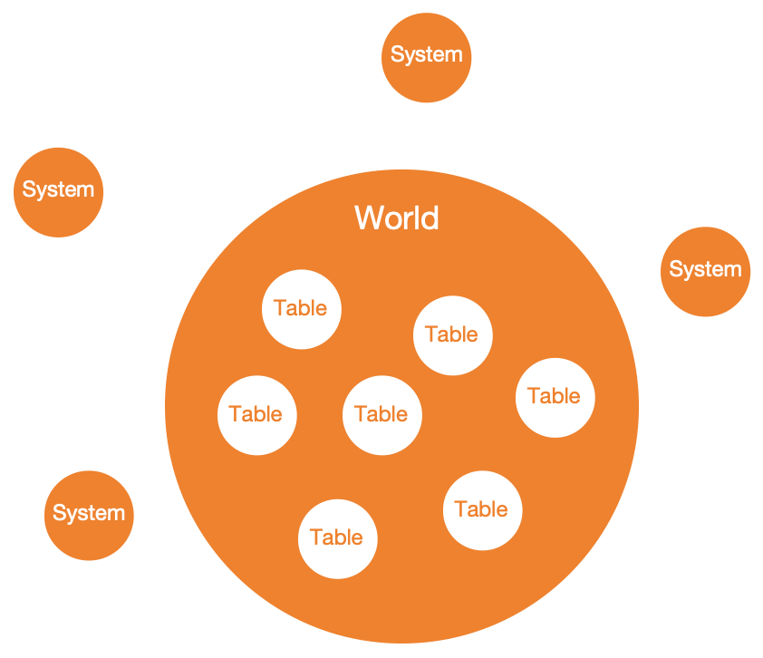
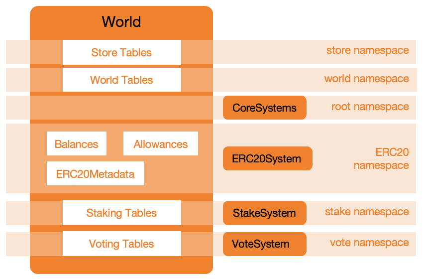

自主世界
===================

从现在开始，我们把每个用 Mud 构建的应用都称作是一个自主世界。
自主世界本质上是一系列智能合约，在核心存储协议和资源使用及管理协议下，通过多种形式的合约交互所构成的一个有组织的整体。

**理解自主世界的构成及其运作方式，是灵活使用 Mud 框架的关键。**

组成部分
----------------

在 :ref:`Mud 框架介绍 <brief-introduction>` 中，我们提到了 Mud 同 Diamond 一样，数据与业务逻辑分离。

为了方便理解，假设我们要实现的项目是一个标准的 ERC20 代币，数据与业务逻辑分离，即 ``ERC20 Metadata``,
``balances`` 以及 ``allowances`` 存储在一个合约中，而 ``transfer`` 以及 ``approve`` 等方法
被实现在其他合约中。

上图形象的表示了一个由 Mud 构建的基础的自主世界的构成。图中每个橙色的圆圈都代表一个合约实例。中间最大的就是
自主世界的主合约 ``World`` ，它包含了所有用 ``Table`` 实现的数据存储。围绕在主合约外围的是承载业务逻辑的 ``System`` 合约，
它们的作用就是指导主合约在不同的交互场景下如何操作其内部的数据，但它们不存储任何数据。

带数据存储的 ``World`` 连同所有围绕的不带数据存储的 ``System`` 共同构成了一个简单的自主世界实例。

对于我们的 ERC20 代币项目而言，一种实现的可能是，2个合约，3个表，1个系统。
2个合约分别是 ``World`` 以及 ``ERC20System`` 。
3个表分别是 ``ERC20Metadata`` ， ``Balances`` 以及 ``Allowances`` ，均储存于 ``World`` 合约内。
1个系统是 ``ERC20System`` 包含所有 IERC20 接口的实现。

运作方式
----------------

当 ERC20 代币的 ``balances`` 数据和 ``transfer`` 方法分别位于两个不同的合约 ``World`` 以及
``ERC20System`` 时，最常见的让转账方法还能正确修改余额信息的方法是。

.. code-block::

  --> call, ==> delegatecall

  EOA/Contracts --> World ==> ERC20System

1. 将 ``World`` 作为代币的地址，意味着所有 IERC20 方法的交互入口。
2. 为 ``World`` 添加 ``IERC20.transfer`` 方法的后备 ``fallback``。
3. 在 ``IERC20.transfer fallback`` 实现里以 ``delegatecall`` 形式调用
   ``ERC20System.transfer`` 合约方法，直接对 ``balances`` 进行修改。

这也是各种代理合约和 Diamond 的基本原理。

除此之外我们还有一种更朴素的方法，使用最基本的合约间交互 ``call`` 替代 ``delegatecall``。

.. code-block::

  EOA/Contracts --> World --> ERC20System --> msg.sender: World
                                   └--------> msg.sender: World

1. 将 ``World`` 作为代币的地址，意味着所有 IERC20 方法的交互入口。
2. 在 ``World`` 合约内记录 ``address(ERC20System)`` 有权限更新 ``Balances`` 表。
3. 为 ``World`` 添加 ``IERC20.transfer`` 方法的后备 ``fallback``。
4. 在 ``IERC20.transfer fallback`` 实现里以 ``call`` 形式调用
   ``ERC20System.transfer`` 合约方法。
5. ``ERC20System`` 以 ``call`` 形式调用 ``msg.sender: World`` 查询 ``Balances`` 表，
   获取发送者和接受者的余额信息。
6. 计算转账后两个地址的新余额信息， ``ERC20System`` 以 ``call`` 形式调用 ``msg.sender: World``
   更新 ``Balances`` 表。

.. note::

   ``ERC20System`` 必须知道去哪里查询和更新 ``Balances`` 表。利用合约调用关系通过 ``msg.sender``
   拿到 ``World`` 的地址是一种方法。

   在 ``ERC20System`` 合约内记录下 ``World`` 合约的地址是另一种方法，但这种方法违背了数据与业务逻辑分离的原则，
   损害了逻辑合约复用的特点。

.. note::

  后者相较于前者，可以引入权限控制， ``World`` 根据 ``msg.sender`` 判断是否有权限更新特定的表。

  前者因为没有脱离 ``World`` 的语境，可以修改自身所有的 ``slot``, 也就是对所有表都有写权限，并且无法在合约层限制。

两种方法的共同点是 **World 是自主世界的统一入口**。 即使未来我们想引入更复杂的逻辑，例如为我们的 ERC20 代币项目添加
质押获利功能，那也是在同一个 ``World`` 中创建更多的表，部署更多的系统，并用上述任意一种方式建立与 ``World`` 的交互关系，
我们仍然只有一个交互的入口，那就是 ``World`` 合约。

两种方法的区别仅体现在 ``World`` 与 ``System`` 的交互方式上。带来的影响是前者不仅能实现对 ``Balances`` 表的修改，
还能实现对 ``Allowances`` 表，甚至其他所有表的修改。
而后者只能实现对 ``Balances`` 表的修改，也只能允许有权限的地址进行修改。两者各有优劣，前者更方便，后者更安全。

Mud 同时支持上述两种方法。在一个自主世界中， ``World`` 与一部分 ``System`` 采用第一种交互方式的同时，与另一部分采用第二种
交互方式。这种交互方式的选择完全取决于 ``System`` 所处的命名空间 ``namespace`` 。
命名空间 ``namespace`` 正是 Mud 实现权限控制的基础。

.. note::

   当系统属于自定义的命名空间时， ``World`` 合约通过 ``call`` 与系统合约交互。
   当系统属于 ``root`` 命名空间时， ``World`` 合约通过 ``delegatecall`` 与系统合约交互。

   开发者可以根据自己的需要灵活选择命名空间。

权限控制
----------------

设想我们的 ERC20 代币项目获得了巨大的成功，我们决定加入质押、挖矿、投票等各种 defi 里常见的功能。
每一种功能的实现都势必会引入新的表和新的系统。随着表和系统数量的增加，我们迫切需要一套管理体系，既让每个系统能够
更新它们需要的表，也让每个系统只能更新它们需要的表。举个例子，质押系统能够更新与质押有关的所有的表，比如质押状态、质押奖励，
但无法更新与投票有关的表，比如投票权重等。

这听上去十分简单，就像你是一家公司的老板，你会把负责不同业务的员工分配到不同的部门。
并在办公系统中，根据员工的 ID 或他们所在的部门，分配不同的文件访问权限和系统使用权限。

这同样也是 Mud 在做的事情：

1. ``System`` 和 ``Table`` 都被称为资源，为每个资源分配唯一的 ``ResourceId`` 标识。
2. 建立资源等级，用更高级的命名空间 ``namespace`` ，作为系统和表资源的上级资源。
3. 以命名空间为单位控制资源访问权限。

资源标识是资源有效管理的第一步。
``ResourceId`` 是一个底层为 ``bytes32`` 的数据， 由三个固定长度的字符串的字节数组拼接而成。
第一个字符串，长度为 **2**，表示资源的类型，包括链上表 ``tb`` 、链下表 ``ot`` 、系统 ``sy`` 、命名空间 ``ns`` 。
第二个字符串，长度为 **14**，表示资源所在的命名空间的名称。
第三个字符串，长度为 **16**，表示资源的名称。

.. note::

   当资源类型为 ``ns`` 时， 资源名称取空字符串。

对资源进行分级，可以实现多维度的资源权限控制。
命名空间是一系列系统和表资源构成的整体，同时也是一种高级的资源。

如此一来，增加质押、投票功能后的 ERC20 代币项目在自主世界中可能呈现下图的样子。

实现 IERC20 所需的 3 个表和 1 个系统被划分到 ``ERC20 namespace``。
实现质押挖矿功能所需的表和系统被划分到 ``Stake namespace``。
实现投票功能所需的表和系统被划分到 ``Vote namespace``。

这样， ``ERC20System`` 只能更新 ``ERC20 namespace`` 下的表，
``StakeSystem`` 只能更新 ``Staking Tables``，
``VoteSystem`` 只能更新 ``Voting Tables``。
不过不用担心数据壁垒问题，系统只是不能更新其他命名空间的表，只读访问仍然是可行的。
因为所有的表都是完全公开透明的。

.. note::

   在一个自主世界中， 开发者最常使用的两个命名空间分别是 ``root`` 和自定义命名空间。
   其中 ``root`` 命名空间默认拥有一系列核心系统 ``AccessManagementSystem`` 等，提供各种自主世界的基础功能，
   如权限配置。

.. note::

   每个自主世界还有两个特殊的命名空间 ``store`` 和 ``world`` ，分别代表 ``Store protocol`` 和 ``World protocol``。
   这是维持自主世界运作的两个核心协议，一个负责底层数据存储实现，一个负责上层的资源使用和管理，包括资源注册和权限控制等。
